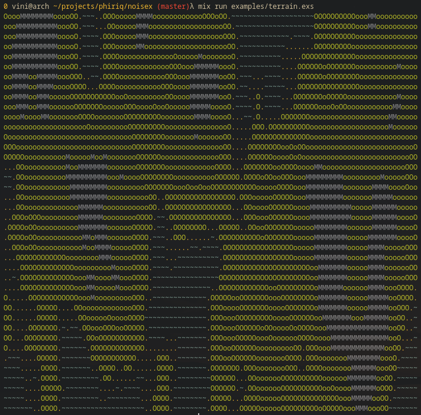
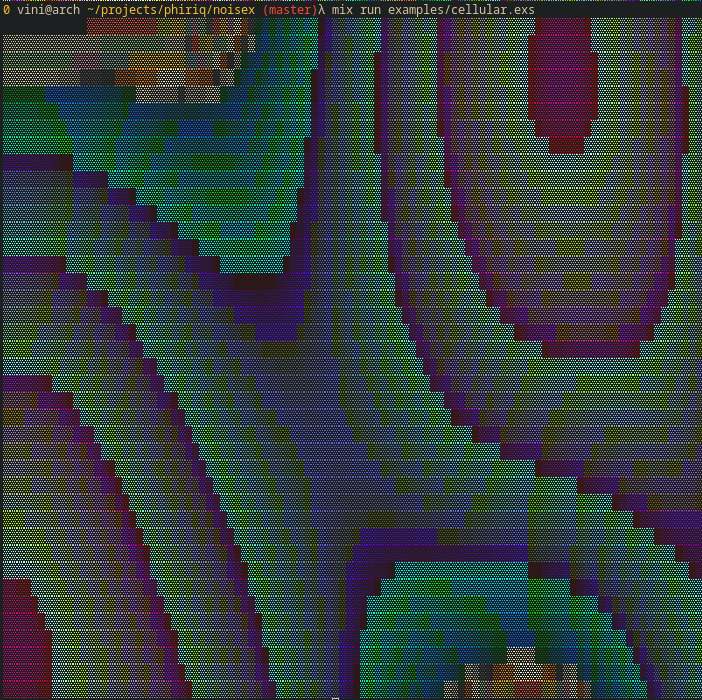

# Noisex


Noisex is a library that provides Elixir bindings to the [bracket-noise](https://crates.io/crates/bracket-noise) crate, which is a rust port of [FastNoise Lite](https://github.com/Auburn/FastNoiseLite).


## Installation

The package can be installed by adding `noisex` to your list of dependencies in `mix.exs`:

```elixir
def deps do
  [
    # Currently tested with Elixir 1.12.1 and Erlang 24.0
    {:noisex, "~> 0.1.2-rc"}
  ]
end
```

## Usage
Check the documentation [here](https://hexdocs.pm/noisex/api-reference.html)

## Examples
You can check and run the examples in the `examples` folder.
```bash
mix run examples/<example>.exs
```

## Images



